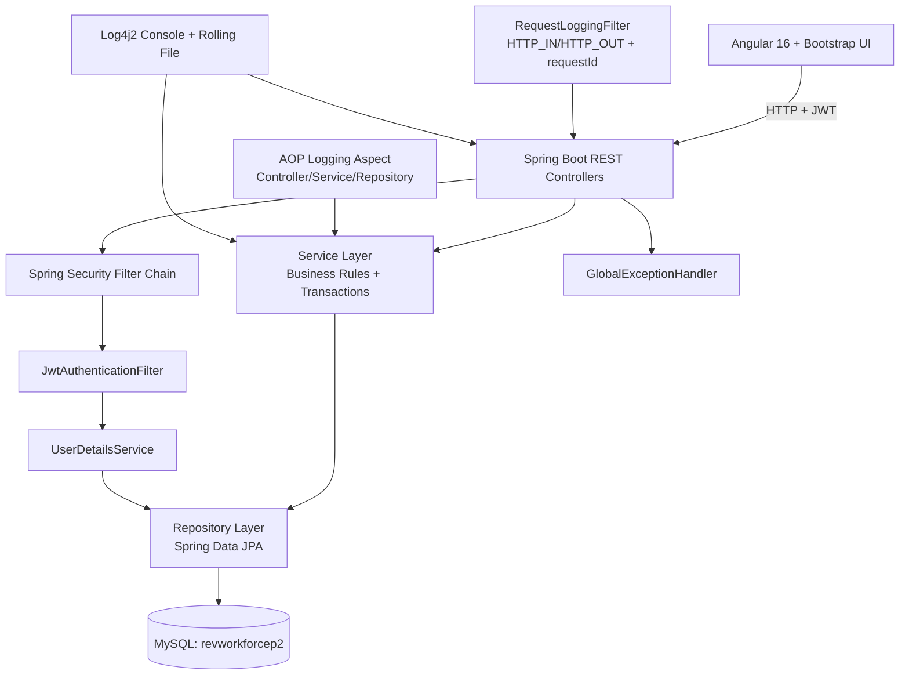

# Application Architecture

## Layers
- Controller: request mapping, validation boundary, response payloads.
- Service: authorization/business rules (leave workflow, goals, reviews, notifications).
- Repository: JPA access to MySQL tables.

## Security Flow
- `/api/auth/login` returns JWT.
- JWT is sent as `Authorization: Bearer <token>`.
- `JwtAuthenticationFilter` validates token and sets security context.
- `@PreAuthorize` guards role-specific endpoints.

## Logging Flow
- Per-request logs with correlation id (`requestId`).
- AOP logs method entry/exit and duration.
- Exception handler logs validation and runtime failures.
