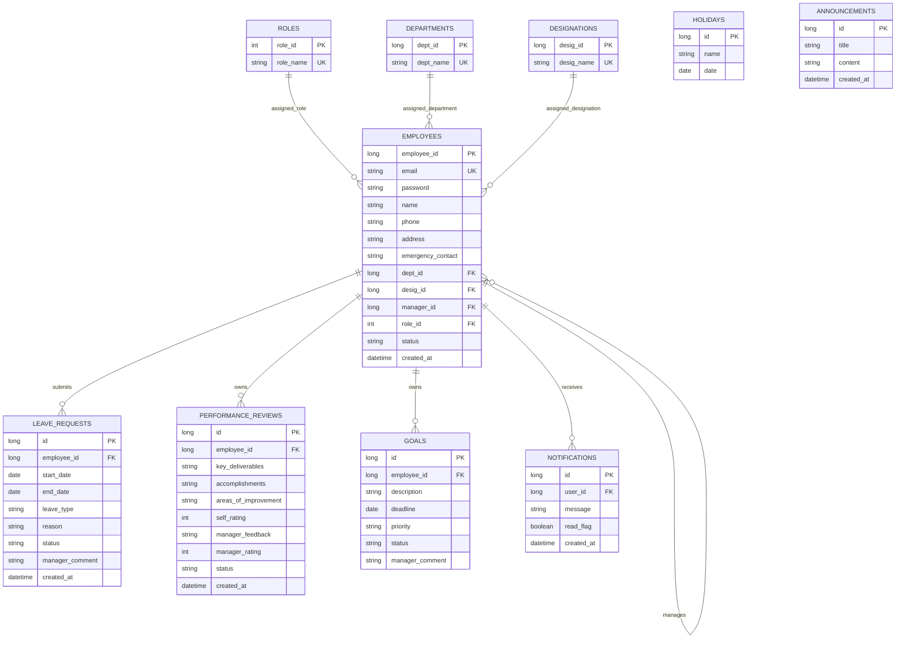

# Entity Relationship Diagram (Current Mapping)

Note: Some environments may still contain legacy duplicate FK columns from earlier mapping attempts (for example `employee_employee_id` / `user_employee_id`). Current code keeps compatibility for those during persistence.
