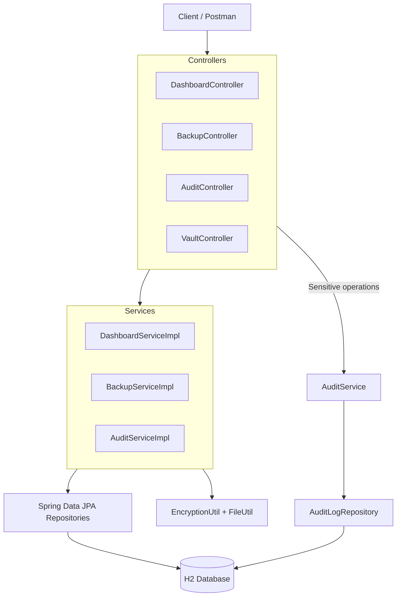

# Architecture Diagram

```mermaid
flowchart TD
    Client[Client / Postman] --> Controllers[REST Controllers]
    Controllers --> Services[Service Layer]
    Services --> Repos[Spring Data JPA Repositories]
    Repos --> H2[(H2 Database)]

    Services --> Utils[EncryptionUtil + FileUtil]
    Controllers -->|Sensitive operations| AuditService[AuditService]
    AuditService --> AuditRepo[AuditLogRepository]
    AuditRepo --> H2

    subgraph Controllers
        DashboardController
        BackupController
        AuditController
        VaultController
    end

    subgraph Services
        DashboardServiceImpl
        BackupServiceImpl
        AuditServiceImpl
    end
```
